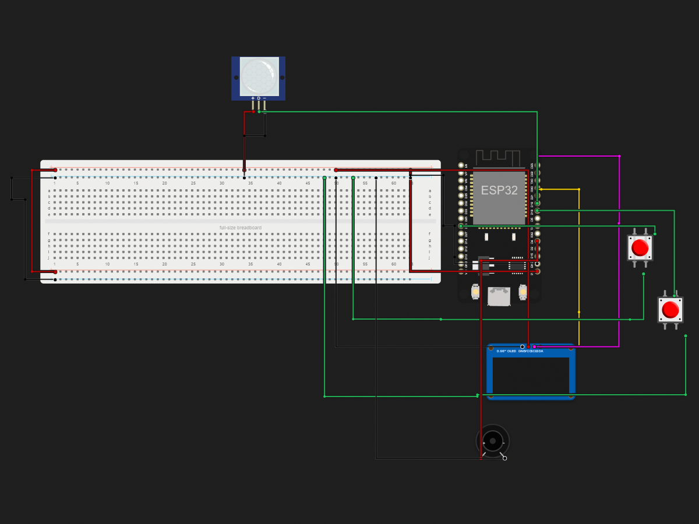

# Entry Counter

> Built in [Breadboard](https://breadboard.hackclub.com), a Hack Club program. This project took ~1.7 hours of work.

## What It Does

A device that uses the motion sensor to count when a person enters and sounds of a buzzer to greet them. (In the program, I experienced an error where the buttons would sometimes act like toggle switches instead of buttons. I don't think the issue was with the code or my wiring though)

## How It Works

The circuit is captured in `breadboard-project.json`, and the firmware that runs it is in the `firmware/` folder.

## How To Use It

Order parts listed in the BOM and connect them like in the photo. After, flash the code from the source files using ESP32 IDE.

Walk past the motion sensor to increment the count. This action is reflected upon the displayed count on the OLED and triggers a sound from the buzzer. To reset the count, press the button connected to the CLEAR_PIN. To decrement the count, press the button connected to the DELETE_PIN.

## Demo

- **Simulate it live:** [https://breadboard.hackclub.com/share/194](https://breadboard.hackclub.com/share/194), runs the firmware in the Breadboard simulator
- **View the design:** [https://taniwankenobi.github.io/breadboard-plays/p/194/](https://taniwankenobi.github.io/breadboard-plays/p/194/)

## Schematic

The editor snapshot is in `breadboard-project.json`.

## Bill of Materials

| Part | Quantity |
| --- | --- |
| breadboard-full | 1 |
| buzzer-active | 1 |
| pir-motion-sensor | 1 |
| pushbutton | 2 |
| ssd1306-i2c | 1 |

## Firmware

Firmware files are in the `firmware/` folder.

## Build Journal

Build journal entries are kept in [`journals.md`](journals.md).

---

*Made in [Breadboard](https://breadboard.hackclub.com) — 1.7h of work*

